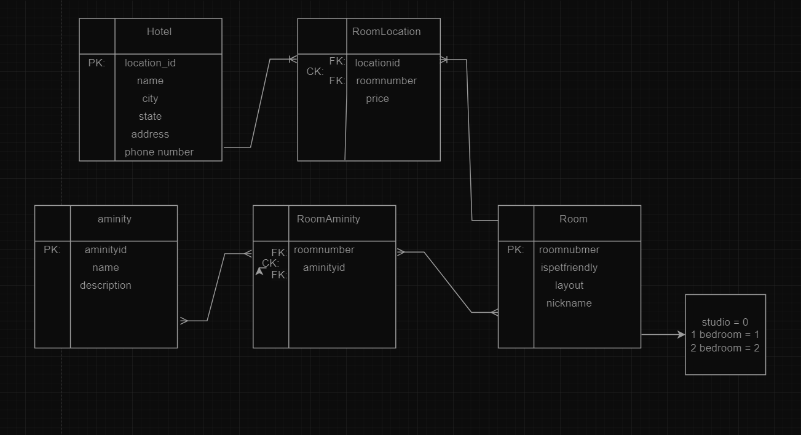

# Async-Inn

## Hotel Table

Primary Key => location_id

attributes:
- name 
- city
- state
- addres
- phone number

Relations: one to many with RoomLocation

## RoomLocation

Primary Key => Composite Key between locationid(source: Hotel) and roomnumber(source: Room)

attributes:
- price

Relations:

many to one with Room

many to one with Hotel

## Room

Primary Key => room number

attributes: 
- price

Relations: 

one to many with RoomLocation

many to many with RoomAminity

has attribute layout that is an ENUM

## RoomAminity

Primary Key => composite key between roomnumber(Room)and aminityid(aminity)

attributes: ---

Relations: many to many with room

many to many with aminity

## Aminity

Primary Key => aminityid

attributes:
- name
- description

Relations: 

many to many with RoomAminity
